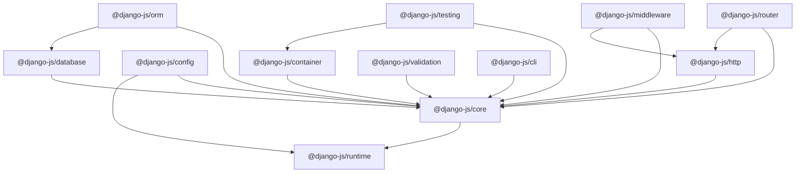

# 03 — Package Dependency Graph

## Architectural Hierarchy

The package dependency tree enforces strict layering:

---

## Allowed Dependencies

1. **`@django-js/runtime`**: No internal framework dependencies.
2. **`@django-js/core`**: Depends on `@django-js/runtime`.
3. **`@django-js/container`**: Depends on `@django-js/core`.
4. **`@django-js/config`**: Depends on `@django-js/core`, `@django-js/runtime`.
5. **`@django-js/http`**: Depends on `@django-js/core`.
6. **`@django-js/router`**: Depends on `@django-js/core`, `@django-js/http`.
7. **`@django-js/middleware`**: Depends on `@django-js/core`, `@django-js/http`.
8. **`@django-js/database`**: Depends on `@django-js/core`.
9. **`@django-js/orm`**: Depends on `@django-js/core`, `@django-js/database`.
10. **`@django-js/validation`**: Depends on `@django-js/core`.
11. **`@django-js/cli`**: Depends on `@django-js/core`.
12. **`@django-js/testing`**: Depends on `@django-js/core`, `@django-js/container`.

---

## Strictly Forbidden Dependency Directions

- `core` → `orm` (Domain/data access must not pollute core lifecycle)
- `core` → `router` (Core must remain transport-agnostic)
- `database` → `http` (Persistence layer must never depend on transport)
- `database` → `router` / `controllers`
- `orm` → `router` / `http`
- `runtime` → `application` / any other package
- Any circular dependencies (strictly checked during lint and compilation)
