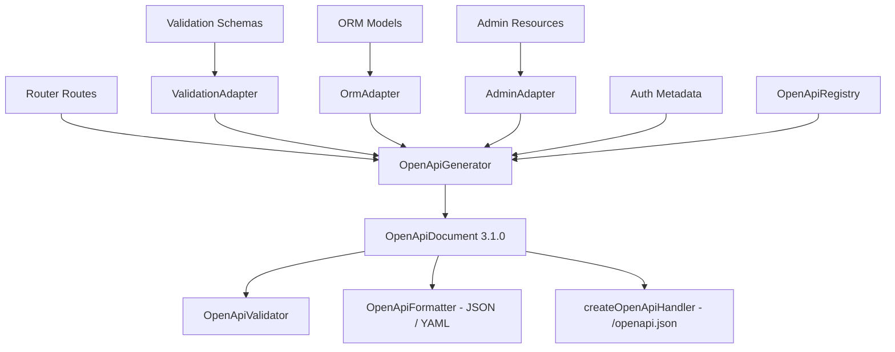

# OpenAPI Architecture & Generation Pipeline (`@jsango/openapi`)

## Overview

`@jsango/openapi` provides deterministic, zero-reflection, metadata-driven OpenAPI 3.1.0 document generation for the JSango framework.

Rather than parsing ASTs, scanning controllers, or executing heavy reflection, the OpenAPI generator derives API specifications directly from:

1. **Router Metadata**: Routes, methods, paths, operation IDs, summaries, tags, parameters, and responses.
2. **Validation Schemas**: Field descriptors, validation rules, types, formats, constraints, and defaults.
3. **ORM Model Metadata**: Model properties, types, nullability, and primary keys.
4. **Admin Resource Metadata**: Dedicated Admin API routes and tags with strict optional opt-in.
5. **Authentication & Authorization Metadata**: Bearer token, cookie/session, API key schemes, and security scopes.

---

## Core Principles

- **Deterministic Generation**: Generated documents are strictly sorted by paths, operations, tags, and schema component names to guarantee reproducible output across runs and builds.
- **Zero-Dependency Core**: YAML formatting and JSON formatting are provided natively without requiring heavy external dependencies in the production runtime.
- **Explicit Admin Isolation**: Admin endpoints are excluded by default (`includeAdmin: false`) to avoid leaking sensitive administrative APIs to public API consumers.
- **Conflict Detection**: Throws structured errors (`DuplicateOperationIdError`, `ConflictingSchemaError`) when operation IDs or incompatible schema definitions collide.
- **Spec Validation**: Built-in validation verifies required top-level fields, path structure, operations, and component schema references.

---

## Architecture Components



---

## Key APIs

### `OpenApiGenerator`

```typescript
import { OpenApiGenerator } from '@jsango/openapi';

const generator = new OpenApiGenerator({
  info: {
    title: 'Acme API',
    version: '1.0.0',
    description: 'Production API spec',
  },
  openapi: '3.1.0',
  includeAdmin: false,
});

const doc = generator.generate(app.router);
```

### `createOpenApiHandler`

Serves the specification over HTTP with optional access control:

```typescript
import { createOpenApiHandler } from '@jsango/openapi';

router.get(
  '/openapi.json',
  createOpenApiHandler({
    generator,
    format: 'json',
    contentType: 'application/json',
  })
);
```

### CLI Commands

- `jsango openapi:generate [--output <path>] [--format json|yaml] [--include-admin]`
- `jsango openapi:validate [--file <path>] [--include-admin]`
